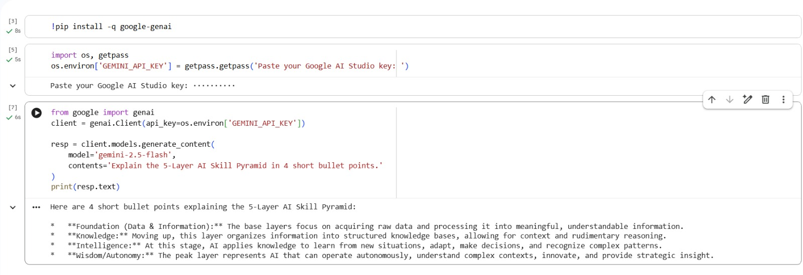

# AI Mentor Bootcamp — Pokanati Gangababu
## Day 1 — Setup complete

- ✅ Google AI Studio API key provisioned
- ✅ Groq API key provisioned
- ✅ Hello-Gemini call working — see [Day1_Setup.ipynb](Day1_Setup.ipynb)
- 4-tool comparison matrix from Lab 1A: see screenshot below


```


 Day 4 — Productivity sprint

**Company:** TCS
**Time:** 45 minutes (timeboxed)

### Edit notes (3 lines)

1. Gamma confabulated a "hiring 50,000 freshers in 2025" stat on slide 6. Source said 40,000. Edited.
2. Slide 4 listed "Kubernetes" as a required skill — actually nice-to-have per the JD. Edited.
3. Slide 1 (cover) — replaced Gamma's generic "Your Career Awaits" with a company-specific line.

 Day 4 — n8n Daily News Digest

- ✅ Self-hosted n8n via Docker
- ✅ Workflow: Schedule (7AM IST) → RSS → Gemini summariser → Gmail
- ✅ Workflow JSON committed: [Day4_NewsDigest.json](Day4_NewsDigest.json)
- ✅ Test email screenshot below


Day 5 Lab 5B — Hugging Face Pulls

### Models tested
- `facebook/bart-large-mnli` — zero-shot classification
- `distilbert-base-uncased-finetuned-sst-2-english` — sentiment

### Timing comparison

| | min | avg | Notes |
|---|-----|-----|-------|
| HF Inference API | 0.8s | 1.2s | Cold-start: 20s |
| Local in Colab | 2.1s | 3.4s | Download: 60s on first run |

### When to use each (3-line reflection)

1. **API:** for low-volume, occasional calls. Avoids download. Cold-start risk on first call after idle.
2. **Local:** for batch processing 100+ items, where you want predictable latency and don't pay per call.
3. **Production rule of thumb:** if your usage exceeds the API free tier (~30K requests/month at HF), self-host. Otherwise API.


## Day 9 Lab 9A — Hello-LangGraph

- 1-tool ReAct agent with DuckDuckGo web_search
- 4-message trace on a live-fact question (TCS 2026 hiring)
- Failure case: bad URL → agent reported "could not find" / agent hallucinated [pick one]

### Reflection

1. The trace IS the explanation. Print every step.
2. The doc-string IS the prompt. Bad doc-string = bad tool selection.
3. Real agents handle tool failures gracefully — define failure modes in the doc-string.

